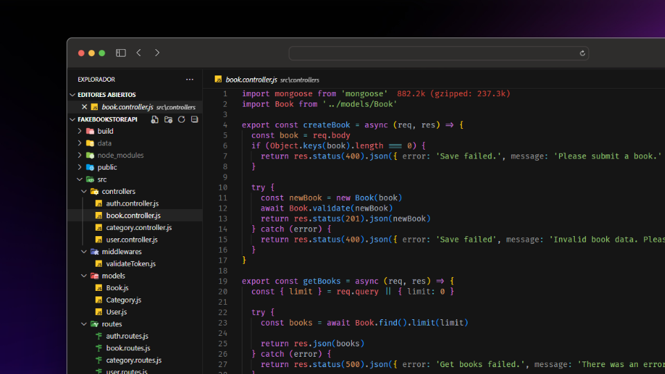

# Fake Book Store API :books: :books:



Fake Books API is a free online REST API that you can use whenever you need pseudo-real data for your library application, whether for development, testing, or educational purposes. This API provides dummy information about books, authors, and categories with authentication. :closed_book:

## Development tools used :gear:

The tools used to develop this service were...

<div align='center'>


</div>

## Resources

The Fake Book Store API offers a complete set of modules covering the main entities needed for shopping prototypes and library-related applications. 

These modules include:

- **Users:** :bust_in_silhouette: https://fake-book-store-api.onrender.com/api/users
- **Books:** :green_book: https://fake-book-store-api.onrender.com/api/books
- **Categories:** :jigsaw: https://fake-book-store-api.onrender.com/api/categories
- **Auth:** :key: https://fake-book-store-api.onrender.com/api/auth/login

### User module

#### Get all users

```js
fetch('https://fake-book-store-api.onrender.com/api/users')
  .then( res => res.json())
  .then( data => console.log(data))
  .catch( error => console.error(error))
```

#### Get a single user

```js
fetch('https://fake-book-store-api.onrender.com/api/users/65a872321c016f2630b07307')
  .then( res => res.json())
  .then( data => console.log(data))
  .catch( error => console.error(error))
```

#### Add new user

In order to add a new user you must be authenticated, and in order to obtain your token you must log in to the endpoint [**Log in**](#log-in). To do this you can use one of the users obtained from the request [**Get all users**](#get-all-users).

```js
fetch('https://fake-book-store-api.onrender.com/api/users', {
  method: 'POST',
  headers: {
    'Content-Type': 'application/json',
    'x-access-token': 'Your token'
  },
  body: JSON.stringify({
    username: 'liam_19',
    email: 'liam@gmail.com',
    password: 'jduhfy76',
    name: {
      firstname: 'Liam',
      lastname: 'Jones'
    }
  })
})
  .then( res => res.json())
  .then( data => console.log(data))
  .catch( error => console.error(error))
```

:zap: If you send a new user, it is not added to the database, it will only return a new user with its unique ID.

#### Update a user

```js
fetch('https://fake-book-store-api.onrender.com/api/users/65aaa62d7899da09b62cd959', {
  method: 'PUT',
  headers: {
    'Content-Type': 'application/json',
    'x-access-token': 'Your token'
  },
  body: JSON.stringify({
    username: 'liam_19',
    email: 'liam@gmail.com',
    password: 'jduhfy76',
    name: {
      firstname: 'Liam',
      lastname: 'Jones'
    }
  })
})
  .then( res => res.json())
  .then( data => console.log(data))
  .catch( error => console.error(error))
```

:zap: If you submit a user, it is not edited in the database, it will just return the user with the updated data.

#### Delete a user

```js
fetch('https://fake-book-store-api.onrender.com/api/users/65aaa62d7899da09b62cd959', {
  method: 'DELETE',
  headers: {
    'Content-Type': 'application/json',
    'x-access-token': 'Your token'
  }
})
  .then( res => console.log(res))
  .catch( error => console.error(error))
```

:zap: It does not return any message, only a **204** response code if you were able to delete the user.

:zap: If you submit a user ID, it is not removed from the database.

### Book module

#### Get all books

```js
fetch('https://fake-book-store-api.onrender.com/api/books')
  .then( res => res.json())
  .then( data => console.log(data))
  .catch( error => console.error(error))
```

#### Get a book limit

```js
fetch('https://fake-book-store-api.onrender.com/api/books?limit=3')
  .then( res => res.json())
  .then( data => console.log(data))
  .catch( error => console.error(error))
```

#### Get a single book

```js
fetch('https://fake-book-store-api.onrender.com/api/books/65a9a8ab22d2eb408ca77c8c')
  .then( res => res.json())
  .then( data => console.log(data))
  .catch( error => console.error(error))
```

#### Add new book

In order to add a new user you must be authenticated, and in order to obtain your token you must log in to the endpoint [**Log in**](#log-in). To do this you can use one of the users obtained from the request [**Get all users**](#get-all-users).

```js
fetch('https://fake-book-store-api.onrender.com/api/books', {
  method: 'POST',
  headers: {
    'Content-Type': 'application/json',
    'x-access-token': 'Your token'
  },
  body: JSON.stringify({
    name: 'When She Loves',
    description: 'The most brutal don in the city has a weakness: me. I never wanted the life my parents tried to force on me, so I vowed I’d never marry a mobster. Yet here I am, walking down the aisle toward mobster of the century, all to save my sister.',
    number_of_pages: 464,
    language: 'English',
    publication_date: '2024-01-14T06:00:00.000Z',
    dimensions: '5 x 1.16 x 8 inches',
    image: 'the url of your image',
    price: 15.29,
    author: 'Gabrielle Sands',
    category: {
      id: '65a86faecc61cd97ff280d43',
      name: 'Science fiction'
    }
})
})
  .then( res => res.json())
  .then( data => console.log(data))
  .catch( error => console.error(error))
```

:zap: If you send a new book, it is not added to the database, it will only return a new book with its unique ID.

#### Update a book

```js
fetch('https://fake-book-store-api.onrender.com/api/books/65aaab157899da09b62cd964', {
  method: 'PUT',
  headers: {
    'Content-Type': 'application/json',
    'x-access-token': 'Your token'
  },
  body: JSON.stringify({
    name: 'When She Loves',
    description: 'The most brutal don in the city has a weakness: me. I never wanted the life my parents tried to force on me, so I vowed I’d never marry a mobster. Yet here I am, walking down the aisle toward mobster of the century, all to save my sister.',
    number_of_pages: 464,
    language: 'English',
    publication_date: '2024-01-14T06:00:00.000Z',
    dimensions: '5 x 1.16 x 8 inches',
    image: 'the url of your image',
    price: 15.29,
    author: 'Gabrielle Sands',
    category: {
      id: '65a86faecc61cd97ff280d43',
      name: 'Science fiction'
    }
})
})
  .then( res => res.json())
  .then( data => console.log(data))
  .catch( error => console.error(error))
```

:zap: If you submit a book, it is not edited in the database, it will just return the book with the updated data.

#### Delete a book

```js
fetch('https://fake-book-store-api.onrender.com/api/books/65aaab157899da09b62cd964', {
  method: 'DELETE',
  headers: {
    'Content-Type': 'application/json',
    'x-access-token': 'Your token'
  }
})
  .then( res => console.log(res))
  .catch( error => console.error(error))
```

:zap: It does not return any message, only a 204 response code if you were able to delete the book.

:zap: If you submit a book ID, it is not removed from the database.

### Category module

#### Get all categories

```js
fetch('https://fake-book-store-api.onrender.com/api/categories')
  .then( res => res.json())
  .then( data => console.log(data))
  .catch( error => console.error(error))
```

#### Get books by category

```js
fetch('https://fake-book-store-api.onrender.com/api/categories/65a86faecc61cd97ff280d43/books')
  .then( res => res.json())
  .then( data => console.log(data))
  .catch( error => console.error(error))
```

### Auth module

#### Log in

```js
fetch('https://fake-book-store-api.onrender.com/api/auth/login', {
  method: 'POST',
  headers: {
    'Content-Type': 'application/json'
  },
  body: JSON.stringify({
    email: 'alice_27@gmail.com',
    password: '8i4nhcbg'
  })
})
  .then( res => res.json())
  .then( data => console.log(data))
  .catch( error => console.log(error))
```

## Installation :rocket:

### MongoDB 

In order to run the application you must have [**MongoDB**](https://www.mongodb.com/) :seedling: installed or you can use [**Docker**](https://www.docker.com/products/docker-desktop/) :whale2: . The configuration to be able to lift a container is as follows:

1. Builds Docker images based on the configuration in docker-compose.yml (A folder `data` will be created that will mount a volume so that the information is not lost when you stop the container).

    ```sh
    $ docker-compose build
    ```

2. Start containers based on the built images.

    ```sh
    $ docker-compose up
    ```


### API

Download and configure the necessary dependencies for the application and run the application.

```sh
$ npm install
    
$ npm run dev
```

Build the project

```sh
$ npm run build

$ npm run start
```

## Things to consider

Images are not saved in a database, they are saved in the project. In the `public/images` folder.

You can access them through the following url: `http://localhost:3000/images/A3sG8jK.jpg` :slightly_smiling_face: .

## Some of my platforms... :innocent:

- [GitHub](https://github.com/FLCHRIS) :black_heart:
- [Website](https://fkhris-ts.netlify.app/) :face_in_clouds:

**HAPPY CODING!!** :upside_down_face: :v: